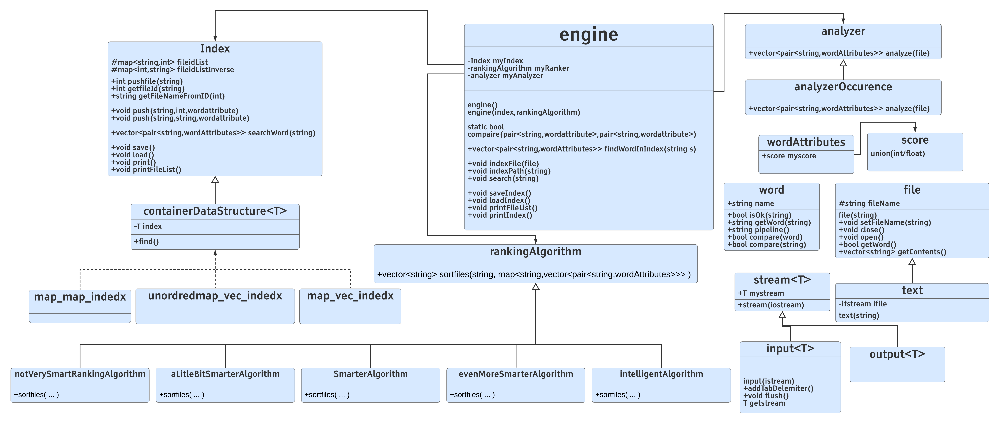

# SHV181 
## A File search engine build in C++
### Overview
    ------------------------------------------------------
          Welcome to SVH181 search engine

    [1] :search     [2] :index      [3] :index a file       [4] :index a path               [0] :exit
    [5] :load index [6] :save index

    >>
### Example
    >>1
    -------search----------
    elon musk
    -----result------
    search for elon musk
    
    ./dataset/Elon_Musk.txt
    ./dataset/Tesla__Inc.txt
    ./dataset/corpus/45567.txt
    ./dataset/corpus/63590.txt
    ./dataset/corpus/48489.txt
    --Search time : 0 h 0 min 0 sec

## Building and Installing

### Install from git repository

you will need :
* C++ complier >= c++17
* openMP library

#### using terminal 
    git colne https://github.com/ghaithsassi/SHV181.git
    cd SHV181
#### windows
to install run

    install.bat

to run 

    f.exe

#### linux
to install on linux:

    ./install.sh

#### Building classes
    g++ -c word.cpp 
    g++ -c stream.cpp 
    g++ -c file.cpp 
    g++ -c index.cpp 
    g++ -c ranking.cpp
    g++ -c engine.cpp -fopenmp
#### Building main 
    g++ -c main.cpp -fopenmp
#### Building exe file
    g++ word.o stream.o file.o index.o ranking.o engine.o main.o -fopenmp -o f

## Usage
* Add files to be indexed in dataset folder
* Before start seaching make sure that  you indexed the files and loaded the index
* The index is saved under index folder
## Documentation

#### Class Diagram

## Contributing
SHV181 is developed by [hmayma](https://github.com/ahmedyassine-hammami) and [ghaithsassi](https://github.com/ghaithsassi) as part of class project

## License
GNU General Public License v3.0 or later
See [LICENSE](LICENSE.md) to see the full text